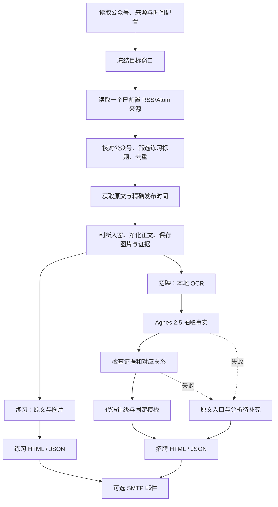

# 微信公众号双日报：第一版最小 MVP 方案

更新：2026-09-21。根据用户最新要求，本版改为“单一可信来源 → 完整原文 → 一个交付渠道”的最小闭环。本文是首版范围与验收依据，不是实现完成记录。

## 1. 第一版到底交付什么

交付一个 Windows 本机双日报工具：配置公众号及来源绑定 → 自动发现文章 → 抓原文并核对身份/时间 → 生成练习和招聘两份报告 → 每天定时执行 → 可选 SMTP 邮件送达。

判断一个模块是否进入首版，只看它是否是这条链路的必要组成。第一版不建设通用微信公众号文章平台。

用户已确认：运行时事实抽取使用 `agnes-2.5-flash`；第一版是最小 MVP。下文的具体实现选择是本轮提出的最小方案；需确认的运行默认值集中写进首次 AGENTS 草稿，不冒充此前已获确认。

## 2. 每个环节是否真的用上

| 环节 | 首版决定 | 用在哪里 |
| --- | --- | --- |
| 公众号、关键词、时间配置 | 保留 | 决定查谁、筛哪些练习、何时运行 |
| 一个 RSS/Atom 消费适配器 | 保留 | 读取用户明确配置的文章来源；不建设 RSS 平台 |
| 搜索结果分页/加载与去重 | 保留必要部分 | 获取本次可见候选，记录截断或覆盖未知 |
| 原文读取与精确发布时间 | 保留 | 正式入窗和内容证据 |
| 微信公众平台后台登录 | 实测后决定 | 仅当实际原文读取链路依赖该会话时接入 |
| 正文净化、图片保存 | 保留 | 安全展示练习、保存招聘图片证据 |
| 本地 OCR | 保留最小实现 | 提取招聘图片里的企业/岗位；练习不使用 |
| Agnes 2.5 | 保留 | 从招聘正文/OCR 文字中抽事实 |
| 证据检查与代码评级 | 保留 | 防止错配、编造和模型自行评级 |
| 两份静态 HTML 与 JSON | 保留 | 用户阅读和查错 |
| 每日调度、跨运行去重、有限补收 | 保留最小实现 | 让工具可日常使用，重启不重复执行，迟到文章可有限补收 |
| SMTP 邮件 | 保留一个渠道，默认关闭 | 发送完整可移植报告；失败时只重发已有报告 |
| 简单启动入口 | 保留 | 登录、手动预览、定时运行、打开报告 |
| MCP | 后置 | 只有外部 Agent 要调用本工具时才有消费者；当前主链路用不到 |
| RSS 发布平台 | 后置 | 本版只消费一个外部 RSS/Atom 来源，不对外发布 Feed |
| Markdown 导出 | 后置 | 只有需要知识库导入/文本阅读时才有用 |
| 网页管理后台 | 后置 | 首版用配置文件和简单启动入口完成操作 |
| FastAPI / REST API | 后置 | 一个 Python 程序内部调用函数，无需 HTTP 服务层 |
| 通用账号搜索、文章库分页/关键词搜索 | 后置 | 属于通用文章平台，不是预先配置公众号后生成日报的前提 |
| 认证主体展示、图片代理 | 后置 | 需要时内部验证登录即可；图片保存在本机，用相对路径展示 |
| 通用文章数据库与复杂缓存系统 | 后置 | 首版只留证据文件、必要内容哈希和小型运行账本 |
| 多 Agent、向量库、训练、云部署 | 不做 | 没有当前需求支持 |

重要区别：消费一个用户选择的订阅源是内部输入；对外提供 Feed、公众号搜索 API 或通用文章搜索页面都不是本版目标。

MCP 不负责调用 Agnes，也不负责定时执行。Agnes 可以直接由 Python 通过 HTTP 调用；定时运行由本地调度代码完成。移除 MCP 不会让双日报缺少任何处理步骤。

## 3. 最小完整流程



失败不直接等于零文章：搜索受阻、原文失败、时间未知、分析失败分别记录。无法可靠入窗的候选留在“待核实”，不算正式文章。微信读书没有结果只能写“本次未发现”，不能证明公众号没有发文。

每篇只有一个安全原文入口。练习不 OCR、不解题、不改写；招聘不让模型输出评级或 HTML，不展示招聘原图，但保留其本地证据。

## 4. 技术结构：一个程序，不拆服务

建议 Python 3.12。采用已有示例的 httpx 调用方式、Playwright 处理实际需要的浏览器操作、本地 OCR、固定 HTML 模板和严格 JSON 校验。具体依赖按实际用途锁定，不先安装 FastAPI 或 MCP SDK。

内部接口即可，例如 `discover(account)`、`fetch_article(url)`、`extract_facts(article)`、`render_report(report)`。名称只是建议，不要求建立通用框架。

建议目录：

```text
app/
  config.py
  contracts.py
  discovery.py
  article_fetcher.py
  evidence.py
  ocr.py
  agnes.py
  validation.py
  rating.py
  reporting.py
  scheduler.py
  cli.py
templates/
config/
tests/
data/               # 忽略：会话、证据、运行账本
output/             # 忽略：真实报告
start.cmd           # 拟定：Windows 简单启动入口
```

模块可在职责清楚时合并，不为了凑目录拆文件。一个小型 SQLite 运行账本足以持久化任务认领/完成/失败状态，不建设通用文章库。正文、图片、OCR、模型响应和必要元数据按运行保存为本地文件。

启动入口先用简单控制台菜单或等价操作：登录、手动预览、开启定时运行、打开报告。不给用户暴露一串内部模块命令，不做网页后台。程序退出或电脑关机后不会继续调度；说明要诚实，不自动安装开机任务。

## 5. 必需的数据契约

| 数据 | 最少保存什么 |
| --- | --- |
| 运行 | 任务类型、目标日期、窗口起止、时区、配置快照、run_id、状态、错误 |
| 候选 | 账号、标题、安全原文 URL、可靠 ID（若有）、相对时间原文、发现时间 |
| 文章 | 来源、精确发布时间及依据、入窗状态、净化 HTML、纯文本、图片与哈希、抓取状态 |
| 证据 | 正文段/图片/OCR 块的稳定标识、文字和内容版本 |
| 抽取 | 文章 ID、企业、岗位、对应地点、招聘类型/开放状态、证据引用、校验状态 |
| 报告 | 完整窗口、生成时间、来源/抓取/分析状态、统计、文章结果、错误和 run_id |

岗位和城市不能只是两个互不关联的数组。例如北京招销售、郑州招算法，不能生成“北京算法”。未知企业性质和规模保持未知，不能用常识填充。

为减少模型负担，单次抽取按一篇文章或一个证据块组织，程序核对文章/分块清单并合并；最终报告按公众号分组。这里明确区分调用级结构与报告级结构，不要求模型每次重建整个日报。

同一份已校验事实供评级、自然段、筛选和 HTML 使用，不再调用模型“润色”引入新事实。JSON 合法、引文存在不能单独证明语义正确；人工抽样仍不可省略。

## 6. 三个小阶段

| 阶段 | 实际交付 | 通过标准 |
| --- | --- | --- |
| A：验证拿得到数据 | 规则、环境、微信读书会话、已知文章发现、原文/时间探针、Agnes 最小协议探针 | 已知真实文章跑通发现→原文→时间；缺权限或入口变化有证据；不得伪造成功 |
| B：先看到双日报 | 配置、窗口、净化、图片、练习报告、招聘无模型报告、JSON 与简单启动入口 | 真实有文章的报告能打开；来源可追溯；失败与空结果分开 |
| C：让最小工具日常可用 | OCR、Agnes 抽取、证据检查、评级、必要筛选、每日调度、运行账本和安装说明 | 真实招聘分析、真实练习、重复调度/故障演练和浏览器检查通过 |

A 的第一件外部任务是验证微信读书当前是否能发现公众号文章。不凭旧描述猜 URL、DOM 选择器或接口。

原文抓取先验证已发现 URL 是否可直接得到正文、图片和可靠发布时间；不需要后台会话就不引入它。若实际依赖公众平台会话，再实现独立扫码及权限检查。公共网页读取工具失败不能证明真实浏览器也不可用；后台能扫码也不能证明所有能力可用。

外部探针未通过时，可继续独立的离线模块，但不能宣布真实链路完成。原规格中的“双登录”“HTTP 文章服务”等，在本首版中是按依赖实测裁剪的设计，不是假装已复刻它们。

## 7. 时间与发布：保留必要的可靠性

以下规则已纳入本轮实现：

- 首版使用 `Asia/Shanghai`；暂不承诺所有 DST 时区都满足固定当地时刻、无缝窗口和每窗 86400 秒。
- 按目标截止时刻冻结 `[end - 86400, end)`；实际执行延迟不移动窗口。
- 手动操作默认“预览”，输出 `output/preview/<run_id>/`，不占用或覆盖正式任务。
- 正式任务按配置分钟运行；可明确启用当天补跑一次，但失败任务不自动重启整窗。允许已开始的任务跨午夜收尾。
- 主窗口仍是 24 小时半开区间；另用有限回看补收原文时间已核验、尚未正式收录的迟到文章。
- 正式运行需要持久去重和跨进程保护；已经认领的任务不能因重启或 config_hash 改变再执行。建议调度时间修改次日生效。
- 调度扫描不能被报告生成阻塞。两份任务同分钟到期时，先分别冻结窗口并认领，再交给有数量上限的执行器；排队到次日仍未开始的任务标为错过，不跨天补启动。
- 只有确认原执行进程已退出，才把其遗留运行标为中断；第二个实例不能把第一个实例仍在执行的任务改成中断。
- 单次网络重试/模型修复设次数与总预算，和整个窗口重新执行分开。
- 企业评级先保持原规格的“企业所有校招机会取最优城市”；不暗改为只按 AI 岗位城市评级。
- 招聘开放状态以目标窗口截止时刻及原文证据判断；未知就展示待核实。

保留 `output/YYYY-MM-DD/招聘.html`、`练习.html`。最小一致发布方案：先完成不可变运行目录里的 JSON/HTML/图片和完成清单，最后一次替换固定 HTML 入口。邮件读取该不可变版本并以内嵌资源发送。每种日报分别发布，互不要求同时成功。

用户看到的是完整新版本、原有明确标记的旧版本或失败状态，不能把旧报告的日期/状态改成今天冒充成功。发布中断和程序重启要实测。

## 8. 首版怎么测，不建设大型评测平台

### 离线测试

固定时钟、临时目录、假微信/假模型并禁止外网。至少覆盖：

1. 窗口左右边界、跨日期、延迟启动、错过分钟、两份任务同分钟到期、双进程和重启；第二实例不干扰原运行。
2. 账号顺序、包含/排除词、近似账号名拒绝、候选去重。
3. 搜索失败、登录失效、全部失败、部分成功、原文时间未知。
4. HTML/危险 URL/图片重定向、文件丢失和哈希变化。
5. 纯实习/社招、校招混表、多企业和岗位地点错配、否定句。
6. 原规格评级全矩阵；未知岗位不随意降级；不能删掉不偏好的校招岗位。
7. 模型无 Key、超时、非法/截断 JSON、改来源、漏文章/岗位、分块重复或失败。
8. 手动预览不改正式账本，发布中断不把半成品标完成。
9. 练习零模型/OCR 调用；招聘原图不嵌入最终 HTML。

先建立约 12 个有明确期望的代表性合成案例，具体数量服从场景覆盖。无需先建设 30 篇真实金标平台或打分仪表盘；不能把减少评测工程理解成不验证真实内容。

### 真实最小验收

- 一个招聘号和一个练习号各有真实文章进入窗口。
- 招聘样本覆盖普通正文、图片/表格、应排除或待核实的内容；缺某类样本时该项明确未验证。
- 逐条人工对照企业、岗位和地点，不能只挑一张好看的卡。至少有一次真实图片 OCR 和 Agnes 抽取。
- 实际打开两份 HTML，检查图片、原文入口、筛选、失败状态及浏览器错误。
- 真正运行一次配置分钟；再演练重复启动、一个账号失败、模型无 Key/超时。
- 用干净环境按说明安装并重复运行离线样例；用户自行扫码/配置后重复真实流程。

测试记录实际命令、退出码、通过/失败/跳过数与证据。首版不声称达到“全站不漏”“模型绝不编造”或未经测量的 95% 召回。30 篇以上的正式质量基准放到后续稳定化阶段。

关键离线检查零失败；真实核心链路未验证不能叫 MVP 完成。原规格后置模块不再是本首版验收门槛，但仍不能声称“原完整规格全部复现”。

## 9. 交付物和需要用户参与的部分

首版交付源码、锁定依赖、空白配置样例、简单启动入口、两份样例报告、测试、实际验收记录、AGENTS.md 和 README.html。

用户只需要确认一次规则/默认值，在本机配置少量公众号、运行时间及 `AGNES_API_KEY`，并亲自完成实际需要的扫码。无需把 Key/Cookie 发到聊天。Agnes 请求固定到已确认地址和模型，不自动回退。

现有调用参考位于 `C:/Users/capygsq/Desktop/keep learning/every_DAY`，仅读取示例代码，不导入其真实配置或业务。当前参考代码默认 2.5，但允许自定义 Base URL；本项目须限制带 Key 的生产请求目标。

本轮未运行真实微信、OCR 或 Agnes，也未写业务代码。Git 已初始化但没有 add/commit/push。

## 10. AGENTS.md 草稿（待确认）

```markdown
# WeChat Dual Digest MVP Instructions

## Project
Build a local Windows tool that discovers WeChat articles through logged-in WeRead,
then produces practice and recruitment HTML reports on a daily schedule.
EXECUTION_PLAN.md defines the first-release scope.
Do not implement deferred platform features merely because the legacy specification lists them.

## Structure and stack
Use Python 3.12, direct Python function calls, httpx, browser automation where required,
local OCR, strict data validation and static HTML templates.
Keep modules small under app/, templates under templates/, and tests under tests/.
Keep sessions, evidence, runtime state and outputs outside version control.
No FastAPI, MCP, RSS, generic article database or administration website in this release.

## Behavior
Keep WeRead as the sole daily discovery source.
Verify original article content and exact publication time; never invent timestamps.
Introduce MP login only if the verified fetching method needs that session.
Practice uses original sanitized text/images, with no OCR or AI.
Recruitment uses local OCR and Agnes agnes-2.5-flash at https://apihub.agnes-ai.com/v1.
Models extract facts only; code validates evidence, applies the agreed rating matrix and renders HTML.
Preserve job-location-evidence relationships. Keep missing facts unknown.
Distinguish search, fetch, analysis and coverage failures.
Persist scheduled execution state and prevent duplicate official runs.
Record approved timezone, preview, schedule-change and publication rules before implementation.

## Workflow
Read before editing. Implement one testable increment, verify it, then continue.
Use fixed clocks, temporary directories and remote fakes in offline tests.
Treat live login, OCR/model quality and browser behavior as separate checks.
Never present mock data, unrun commands or skipped core tests as successful live validation.
Keep AGENTS.md and README.html aligned with actual behavior.
Do not run git add, commit, push, publish or send reports externally without authorization.

## Run and verification
Provide one simple Windows entry for login, preview, scheduled operation and opening reports.
Fill in verified environment, run, test, static-check and compilation commands when implemented.
Do not invent commands that have already passed.
```

## 11. 文档关系与参考

- 本文件：第一版范围与执行方案，替代先前的全功能 MVP 范围。
- `IMPLEMENTATION_PROMPT.md`：给下一个编码模型的执行提示词，与本文件保持一致。
- `wechat-download-api-*.md`：保留完整产品愿景和详细业务规则；扩展能力不纳入第一版。
- 旧“给 GPT-6”提示词：历史背景，不再用其全量交付顺序覆盖首版范围。
- [Agnes 官方文档](https://agnes-ai.com/zh-Hans/docs/agnes-25-flash)：2.5 接口参考，不能替代本机账户实测。
- [OpenAI 提示词指南](https://developers.openai.com/api/docs/guides/prompt-engineering)：参考其明确任务、分隔上下文和给出实例的方法，不限制编码模型品牌。
